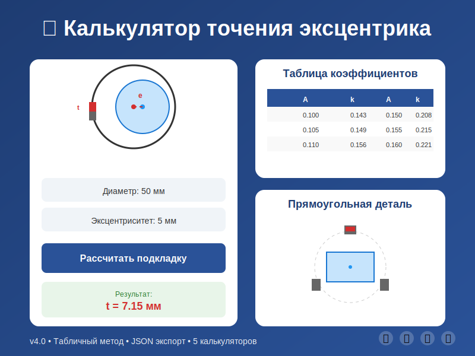

# Структура проекта калькулятора

## 📁 Файлы проекта

```
calculator/
├── index.html          - Главный файл калькулятора (все функции)
├── metadata.json       - Метаданные проекта для портфолио
├── preview.svg         - Превью-изображение для карточки
└── README.md          - Документация
```

## 📊 metadata.json

Файл с метаданными для отображения в портфолио, галерее проектов или каталоге приложений.

### Содержит:
- **title** - Название проекта
- **description** - Подробное описание функционала
- **date** - Дата создания/обновления
- **tags** - Теги для поиска и категоризации
- **image** - Путь к preview изображению
- **version** - Версия калькулятора
- **author** - Автор проекта
- **features** - Список ключевых возможностей
- **categories** - Категории калькуляторов
- **requirements** - Технические требования
- **language** - Язык интерфейса

## 🖼️ preview.svg

Векторное изображение-превью калькулятора для использования в:
- Карточках проектов
- Галереях портфолио
- Социальных сетях
- Документации

**Размер:** 800x600 пикселей
**Формат:** SVG (можно конвертировать в PNG)

### Конвертация SVG в PNG:

**Онлайн:**
- https://cloudconvert.com/svg-to-png
- https://convertio.co/ru/svg-png/

**Командная строка (ImageMagick):**
```bash
convert preview.svg -resize 800x600 preview.png
```

**Браузер:**
Откройте preview.svg в браузере, нажмите правой кнопкой → "Сохранить изображение как" → выберите PNG

## 💻 Использование в портфолио

### Пример HTML карточки:

```html
<div class="project-card">
  
  <h3>Калькулятор точения эксцентрика</h3>
  <p>Профессиональный инженерный калькулятор...</p>
  <div class="tags">
    <span>Инженерия</span>
    <span>Калькулятор</span>
    <span>Визуализация</span>
  </div>
  <a href="index.html">Открыть калькулятор →</a>
</div>
```

### Пример JavaScript загрузки:

```javascript
// Загрузка metadata.json
fetch('metadata.json')
  .then(response => response.json())
  .then(data => {
    console.log(data.title);        // "Калькулятор точения эксцентрика"
    console.log(data.version);      // "4.0"
    console.log(data.features);     // Array[8]
    console.log(data.tags);         // Array[6]
  });
```

## 🚀 Развертывание

### GitHub Pages:
1. Загрузите все файлы в репозиторий
2. Settings → Pages → Source: main branch
3. Калькулятор доступен по адресу: `https://username.github.io/calculator/`

### Netlify/Vercel:
1. Перетащите папку с файлами в веб-интерфейс
2. Автоматически развернется за несколько секунд

### Собственный сервер:
```bash
# Просто скопируйте файлы
cp index.html /var/www/html/calculator/
cp metadata.json /var/www/html/calculator/
cp preview.svg /var/www/html/calculator/
```

## 📱 Адаптивность

Калькулятор полностью адаптивен и работает на:
- 💻 Десктопах (1920x1080 и выше)
- 💻 Ноутбуках (1366x768 и выше)
- 📱 Планшетах (768x1024)
- 📱 Мобильных телефонах (320x568 и выше)

## 🎨 Кастомизация

### Изменение цветов:
Отредактируйте в `index.html`:
```css
background: linear-gradient(135deg, #1e3c72 0%, #2a5298 100%);
/* Измените #1e3c72 и #2a5298 на свои цвета */
```

### Добавление нового калькулятора:
1. Создайте новую вкладку в HTML
2. Добавьте кнопку в `.tabs`
3. Создайте функцию расчета
4. Обновите `metadata.json` - добавьте в `categories`

## 📄 Лицензия

Для образовательных целей.
Можно свободно использовать, изменять и распространять с указанием авторства.

## 👨‍🎓 Автор

Кафедра Инженерной механики
Ташкентский институт текстильной и легкой промышленности (ТИТЛП)

## 📞 Контакты

Для вопросов и предложений по улучшению калькулятора обращайтесь на кафедру.

---

**Версия:** 4.0 (Final Edition)
**Дата:** 16 января 2026
**Статус:** ✅ Готов к использованию